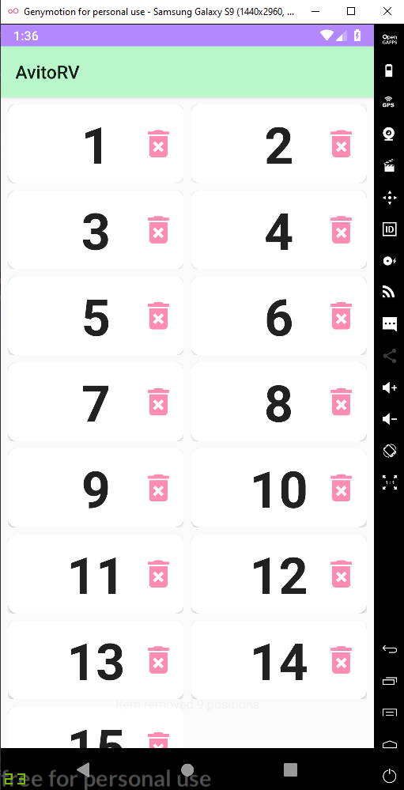
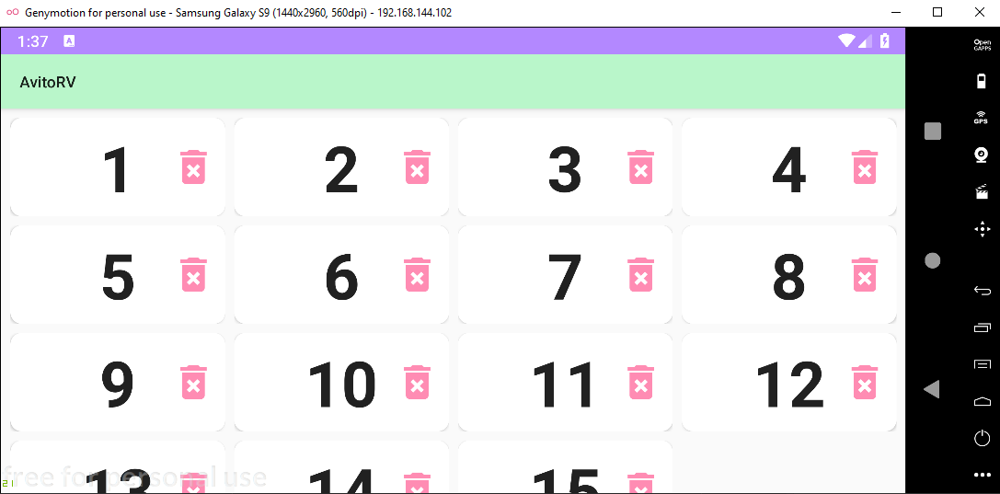

# Avito trainee test RecyclerView

## Требования:
 :white_check_mark: 1. У нас есть экран с RecyclerView, на нем есть список в два столбца, изначально 15 элементов.

 :white_check_mark: 2. У элемента отображается его номер и кнопка удалить, которая его удаляет, то есть такая плиточка с номером и кнопкой

 :white_check_mark: 3. В системе работает что-то асинхронное, которое раз в 5 секунд добавляет новый элемент на случайную позицию

 :white_check_mark: 4. Номер элемента все время наращивается

  :white_check_mark:5.  Добавления и удаления производятся с анимацией (можно стандартной)

  :white_check_mark: 6.  Вся эта система поддерживает поворот экрана и продолжает работать после него

## Требования посложнее:

:white_check_mark: 1. Сделать пулл номеров удаленных элементов и новые добавлять из пула, и если там пусто просто наращивать номер
 :white_check_mark: 2.  В вертикальном положении сделать две колонки, в горизонтальном четыре
 ## Примечания:

 - Задание желательно выполнять на Kotlin. - :white_check_mark:

##

